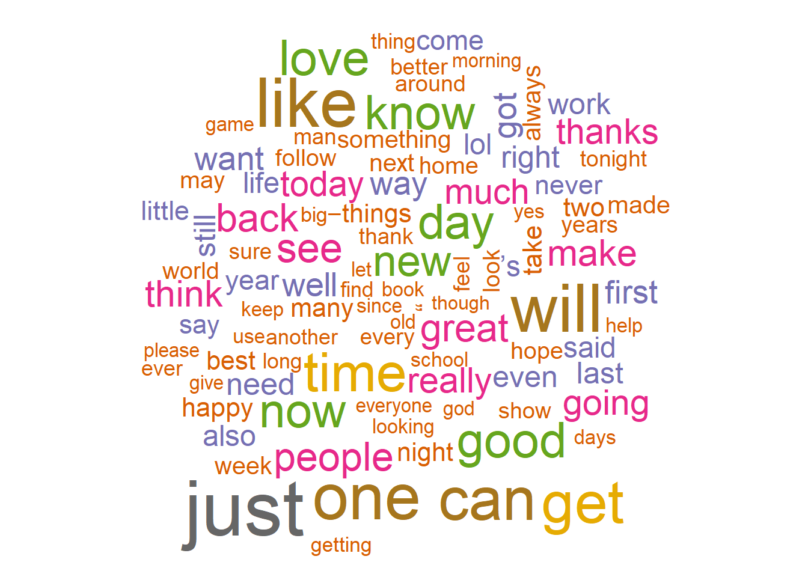
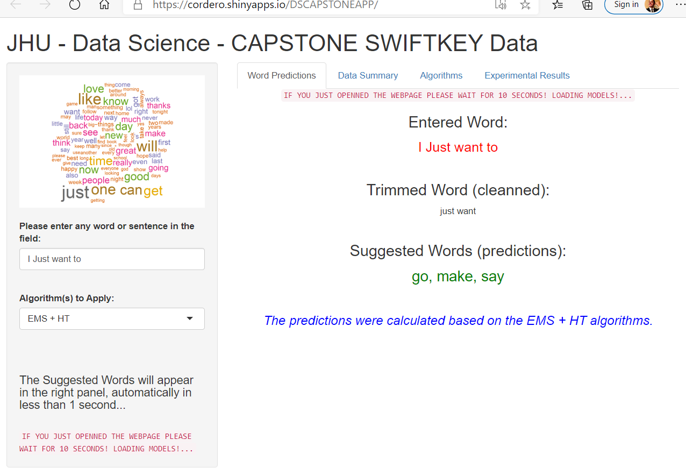

## Word Prediction using SwiftKey data

We constructed two algorithms that learn from the SwiftKey datasets [https://d396qusza40orc.cloudfront.net/dsscapstone/dataset/Coursera-SwiftKey.zip](https://d396qusza40orc.cloudfront.net/dsscapstone/dataset/Coursera-SwiftKey.zip) for the english language (US) and predict the next word given an input sentence. The complete dataset was about 556 MBs in size and had more than lines of text. However, we choose an application that sampled only 3% of that Data at random and built models that take about 6 seconds to load in a shiny app.

{width=21% height=21%}

### General Outline:
The algorithm accepts the word(s) $w_{1}^{n-1}=w_1,w_2,...,w_n$, then tokenizes the sentence into lexems. We aim to predict the next word by firstly taking into consideration the largest n-gram, then the (n-1)-gram down to the (n-2)-gram. For each case we match the entered n-gram with those ones that were extracted from the Corpus. We select and output the top 3 words $w_n$ with the highest Probabilities $P(w_n|w_1^{n-1})$. At the end, we return a list of at most 3 top word suggestions for each n-gram case. Therefore, an entered n-gram will obtain a n sized list of top frequency suggestions.

## Algorithms

### The Exact Match with Backoff (EM) Algorithm

Given an n-gram $g=w_1^{j}=(w_1,w_2,...,w_j)$, obtain a word prediction $h_k$ being $k \leq j$: 

$h(g^k)=h_k$, $h(g^k)=argmax_{w_k+1}(P(w_{k+1}|w_1^{k}))$

using the following approach:

1. Clean the output by removing, punctuation, badwords, spaces and other elements from the word(s). Tokenize and construct an n-gram with the cleanned input. If there are more than 3 input words, just take the last 3 words.
2. Predict the most likely word $w_{k+1}$ with maximum probability: $P(w_n|w_1^{n-1})= \frac{counts(w_1,w_2,...,w_n)}{counts(w_1,w_2,...,w_{n-1})}$.
3. If less than three suggestions have been found, then we reduce the input words $g^k$ to lower level $(j-k)grams$ $g^{k-1}$ and repeat from step 3..

### The Historical Track Algorithm

Predict $h_k$ by finding unobserved lexems in the input word $g^k$:

$T(g^k)=argmax_{w_k+1}(P(w_k+1|V_1^k))$ where $V=W \cup Z$ where $W$ are observed words and $Z$ are unobserved words.

1. We clean and tokenize the input and obtain an input n-gram predictor $g^k$.
2. Divide $g^k=w_1^n$ into pairs $(w_i,w_{i-1})$ according to the chain rule applied to the bigram model: $P(w_n|w_1^{n-1}) = P(w_1)P(w_2|w1)P(w_3|w_2),...,P(w_n|w_{n-1})$
3. For each pair of words $(w_i,w_{i-1}) \in w_1 ^n$: 
  - if both $(w_i, w_{i-1})$ have been previously observed, then keep them and obtain their probability $P(w_i|w_{i-1})$.
  - if only $w_i$ has been previously observed, then find the observed $w_{j}$  with maximum  probability $P(w_i|w_j)$ and replace $w_{i-1}$ with $w_j$, in other words autocomplete the pair $(w_i, w_j)$.
  - if $w_{i-1}$ has only been observed, then discard $w_i$ and the probability becomes $P(w_i|w_{i-1}) = P(w_{i-1})$.
4.Predict the top three words $w_{k+1}$ with the highest probabilities $P(w_n|w_1^{n-1})$ from the autocompleted sequence$(w_1,w_2,w_{i-1},w_i,...,w_k)$

## Experimental Results: Accuracy
- We tested accuracy $acc(w_n, t_n) = 1$ iff $w_n = t_n$ where$w_n$ is the predicted word and$t_n$ is the true word that was held out in the experiment. 0 otherwise.

```{r tableAcc, echo=FALSE}
accuracyTable <- data.frame( Sample.Size = c(".1%",".1%",".1%",".5%",".5%",".5%","1%","1%","1%","3%","3%","3%"),
                             n.gram = c("bigrams", "trigrams", "tetragrams","bigrams", "trigrams", "tetragrams","bigrams", "trigrams", "tetragrams","bigrams", "trigrams", "tetragrams"),
                             Accuracy.Percentage.EMS = c(25.64, 26.16, 24.72, 44.84, 44.28, 41.60, 55.87, 55.01, 54.93, 60.28, 61.99, 	60.28),
                             Accuracy.Percentage.HT = c(13.32, 24.36, 24.32, 13.31, 16.32, 38.52, 14.88, 7.22, 4.92, 9.36, 3.57, 3.82),
                             Accuracy.Percentage.EMS.HT = c(28.44, 26.52, 25.08, 47.16, 46.08, 42.61, 	60.12, 72.60, 71.64, 72.12, 81.36, 80.04)
)

DT::datatable(accuracyTable, options = list(lengthMenu = c(5, 10, 150), pageLength = 15))   
```

## Experimental Results: Perplexity

- We computed perplexity: The intuition behind this metric is that "the best language model is the one that best predicts an unseen test set". Perplexity = $(\frac{1}{P(w_1, w_2, ..., w_n)})^{1/n}$ where $n$ is the n-gram level and $P(w_1, w_2, ..., w_n)=P(w_1)P(w_2|w_1)P(w_3|w_2, w_1), ...,P(w_n|w_{1}^{n-1})$ is the joint probability distribution of observing word $w_n$ after words $ w_1^{n-1} = w_1, w_2, ..., w_{n-1}$.

```{r tablePerplexity, echo = FALSE}
perplexityTable <- data.frame( Sample.Size = c(".1%",".5%","1%","3%",".1%",".5%","1%","3%",".1%",".5%","1%","3%"),
                               n.gram = c("bigrams","bigrams","bigrams","bigrams","trigrams","trigrams","trigrams","trigrams","tetragrams","tetragrams","tetragrams","tetragrams"),   
                               Accuracy = c(	28.44, 47.16, 	60.12, 72.12, 26.52, 46.08, 72.60, 81.36, 25.08, 42.61, 71.64, 80.04),
                               mean.Perplexity = c( "19,407.643", "10,926.306", "8,829.629", "7,053.359", "22,929.987", "15,065.242", "	13,094.427", "11,244.204", "27,110.892", "19,839.251", "17,637.174", "	15,753.426"))

DT::datatable(perplexityTable, options = list(lengthMenu = c(5, 10, 150), pageLength = 15))
```

## Shiny App Online

Best results obtained by using the EM + HT algorithms.

{width=41% height=41%}
The App provides:

- Prediction tool.
- Summary of sampled Data.
- Details of EM and HT algorithms.
- Tables of Experimental Results.

Shiny app available at [https://cordero.shinyapps.io/DSCAPSTONEAPP/](https://cordero.shinyapps.io/DSCAPSTONEAPP/).